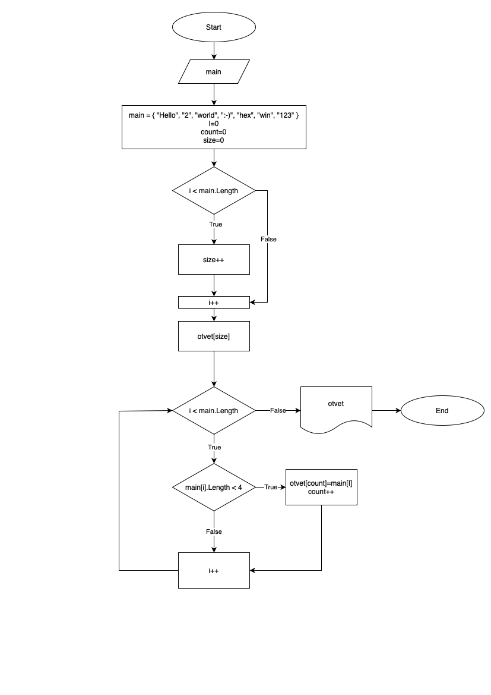

# Решение задачи:
Данная программа, из имеющегося массива строк формирует новый массив из строк, длина которых меньше, либо равна 3 символам. 
Первоначальный массив задан на старте выполнения алгоритма.
Для вывода массива с ответом используется метод void.

# Блок-схема данной задачи

# Решение задачи в program.cs

using System;
using static System.Console;
Clear();

string[] main = { "Hello", "2", "world", ":-)", "hel", "win", "123" };

PrintArray(main);

void PrintArray(string[] main)
{
    int size = 0;
    int count = 0;

    for (int i = 0; i < main.Length; i++) 
    { 
        if (main[i].Length < 4) {size++;}
    }

string[] otvet = new string[size];

for (int i = 0; i < main.Length; i++)
    { 
    if (main[i].Length < 4) 
        {
        otvet[count] = main[i];
        count++;
        }
    }

for (int i = 0; i < otvet.Length; i++) {Console.WriteLine(otvet[i]);}
}